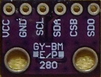
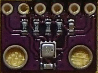

# FlashAir-SlibBME280

Lua library for BME280 environmental sensor for FlashAir.

## Tested equipment

Tested on this GY-BME280 module with BME280 and FlashAir W-04 v4.00.03.

 

## FlashAir to BME280 module connections

GY-BME280 has 10korm pull-up register for SCL, SDA, CSB.  
And it has 10korm pull-down register for SD0.  
So, register is not necessary.

GY-BME280 module | FlashAir(Pin#) | Power | Memo
--- | --- | --- | ---
SD0 |CLK (5) | |CLK pull-down in module
SCL |CMD (2) | |SCL pull-up in module
SDA |DAT0(7) | |SDA pull-up in module
--- |DAT1(8) | |
--- |DAT2(9) | |
--- |DAT3(1) | |
CSB |---     | |CSB pull-up in module
VCC |VCC (4) |3.3V|   
GND |VSS(3,6)|GND |  

## Install

SlibBME280.lua -- Copy to somewhere in Lua's search path.

## Parameters settings

*Please see the BME280 datasheet for details.*

**Controls the sensor mode of the device**

mode | Mode
--- | ---
0| Sleep mode
1 2| Forced mode
3| Normal mode

**Controls inactive duration tstandby in normal mode**

t_sb| tstandby [ms]
--- | ---
0| 0.5
1| 62.5
2| 125
3| 250
4| 500
5| 1000
6| 10
7| 20

**Controls the time constant of the IIR filter**

filter| Filter coefficient
--- | ---
0| Filter off
1| 2
2| 4
3| 8
4 others| 16

**Controls oversampling of temperature data**

osrs_t| Temperature oversampling
--- | ---
0| Skipped
1| oversampling x1
2| oversampling x2
3| oversampling x4
4| oversampling x8
5 others| oversampling x16

**Controls oversampling of pressure data**

osrs_p| Pressure oversampling
--- | ---
0| Skipped
1| oversampling x1
2| oversampling x2
3| oversampling x4
4| oversampling x8
5 others| oversampling x16

**Controls oversampling of humidity data**

osrs_h| Humidity oversampling
--- | ---
0| Skipped
1| oversampling x1
2| oversampling x2
3| oversampling x4
4| oversampling x8
5 others| oversampling x16

## Usage
If sadr is nil, it will scan the slave address.  
If other parameter is nil, default values is used.  

command | description \<nil for default>
--- | --- 
res = BME280:setup( sadr, frq, mode, t_sb, filter, osrs_t, osrs_p, osrs_h)   or  res = BME280:setup{ sadr=xx, frq=xx, mode=xx, t_sb=xx, filter=xx,  osrs_t=xx, osrs_p=xx, osrs_h=xx}|**Setup BME280** **res:** Same as return value of fa.i2c().  **sadr:** I2C slave address (7bit) \<auto scan> **frq:** I2C clock frequency. (45 or 100 or 189 or 40) <400> **mode:** Controls the sensor mode of the device. <3> **t_sb:** Controls inactive duration tstandby in normal mode. <0> **filter:** Controls the time constant of the IIR filter. <4> **osrs_t:** Controls oversampling of temperature data. <2> **osrs_p:** Controls oversampling of pressure data. <1> **osrs_h:** Controls oversampling of humidity data. <5>
res, temp, humi, pres, alti, thi =  BME280:readData( pres_sea )  |**Read environmental value** **res:** Same as return value of fa.i2c() **temp:** temperature [DegC] (-45..85) **humi:** humidity [%rH] (0..100) **pres:** pressure [hPa] (300..1100) **alti:** altitude [m] **thi:** temperature-humidity index [%] (0..100)  **pres_sea:** sea-level pressure[hPa] <1013.25>

## Licence

[MIT](https://github.com/AoiSaya/FlashAir-libBMP/blob/master/LICENSE)

## Author

[GitHub/AoiSaya](https://github.com/AoiSaya)  
[Twitter ID @La_zlo](https://twitter.com/La_zlo)
